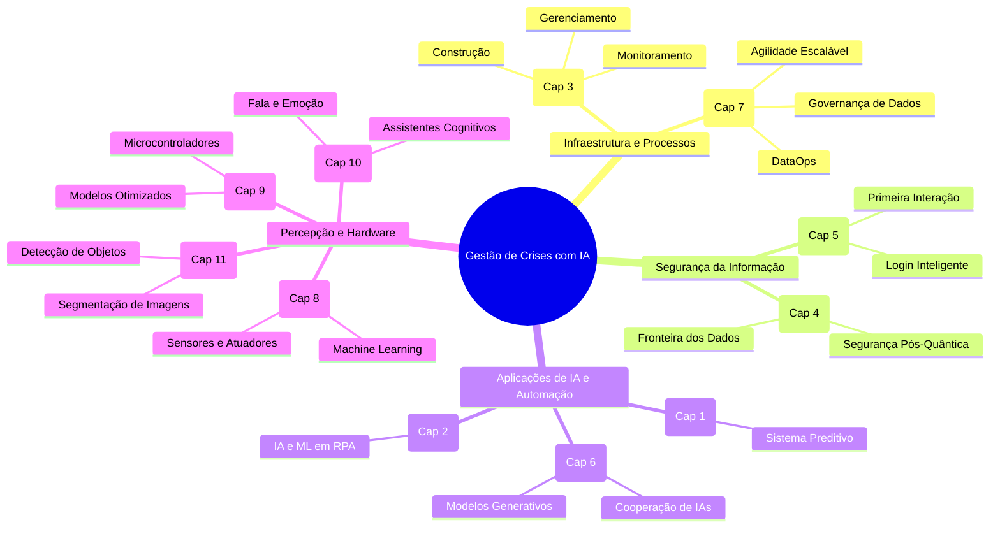

# FIAP - Fase 6: Gestão de Crises com Sistema Preditivo em IA

Este repositório centraliza e organiza todos os materiais de estudo para a prova da **Fase 6** do curso. O objetivo é facilitar a leitura, revisão rápida e preparação de outros estudantes.

---

## ⚡ Links Rápidos e Flashcards

*   📚 **NotebookLM Flashcards:** [Acesse os Flashcards Interativos no NotebookLM](https://notebooklm.google.com/notebook/cd4eef03-6b11-48f8-bc0b-fe926fd23ff9/artifact/8036fd93-7856-42cc-b02e-a4947a9a2736?utm_source=nlm_web_share&utm_medium=google_oo&utm_campaign=art_share_1&utm_content=&utm_smc=nlm_web_share_google_oo_art_share_1_) (Ótimo para revisar termos e conceitos fundamentais antes da prova!).
*   📖 **E-book EPUB para Kindle:** [compilados/Curso_Gestao_Crises_IA_Completo.epub](./compilados/Curso_Gestao_Crises_IA_Completo.epub)
*   🔌 **E-book AZW3 para Kindle (Cabo USB):** [compilados/Curso_Gestao_Crises_IA_Completo.azw3](./compilados/Curso_Gestao_Crises_IA_Completo.azw3)
*   📄 **PDF Completo Unificado:** [compilados/Curso_Gestao_Crises_IA_Completo.pdf](./compilados/Curso_Gestao_Crises_IA_Completo.pdf)

---

## 📁 Estrutura do Repositório

O repositório está organizado da seguinte forma:

```
├── originais/                      # Capítulos originais (PDFs individuais)
│   ├── cap01.pdf
│   └── ...
├── compilados/                     # Versões consolidadas de estudo
│   ├── Curso_Gestao_Crises_IA_Completo.pdf    # PDF com todos os capítulos unidos
│   ├── Curso_Gestao_Crises_IA_Completo.epub   # EPUB com índice e formatação fluida (Kindle Cloud)
│   ├── Curso_Gestao_Crises_IA_Completo.azw3   # AZW3 com sumário integrado (Kindle USB)
│   ├── Curso_Gestao_Crises_IA_Completo.html   # Versão HTML estruturada
│   └── Curso_Gestao_Crises_IA_Completo.md     # Markdown limpo
├── scripts/                        # Scripts em Python para automatizar a compilação
│   ├── process_pdfs.py             # Script que une os PDFs e extrai o Markdown
│   └── markdown_to_html.py         # Script que converte Markdown para HTML otimizado
└── README.md                       # Este guia de estudos
```

---

## 🧠 Mapa Mental do Conteúdo

Abaixo está o mapeamento conceitual dos 11 capítulos, divididos em 4 pilares principais de estudo para a prova:



---

## 📝 Resumo da Grade de Conteúdo (11 Capítulos)

1.  **Capítulo 01: Gestão de Crises com Sistema Preditivo em IA** – Planejamento de cenários, previsão de riscos e resposta rápida a incidentes usando algoritmos preditivos.
2.  **Capítulo 02: Quando a Automação Aprende: Integrando IA e Machine Learning no RPA** – Integração de Inteligência Artificial para tornar robôs de processos repetitivos (RPA) cognitivos e adaptáveis.
3.  **Capítulo 03: Orquestrando o Poder: Construção, Gerenciamento e Monitoramento de Clusters** – Infraestrutura de servidores distribuídos para rodar modelos massivos de IA de forma escalável e tolerante a falhas.
4.  **Capítulo 04: Criptografia Quântica: Segurança e a Nova Fronteira dos Dados** – O impacto da computação quântica na criptografia atual e os novos padrões de segurança pós-quântica.
5.  **Capítulo 05: A Primeira Interação: Autenticação Segura e Experiências de Login Inteligentes** – UX de segurança, autenticação inteligente e proteção na porta de entrada do usuário.
6.  **Capítulo 06: IAs que Cooperam: Colaboração entre Agentes e Modelos Generativos** – Orquestração multiagente de Large Language Models (LLMs) resolvendo problemas de forma autônoma.
7.  **Capítulo 07: Cultura DevData: Acelerando Governança com DataOps e Agilidade Escalável** – Aplicação de práticas DevOps no ciclo de vida dos dados, garantindo qualidade e velocidade para modelos de ML.
8.  **Capítulo 08: Aplicando Inteligência com ML no Mundo Físico** – Como interagir com o ambiente físico utilizando sensores e atuadores governados por modelos de Machine Learning.
9.  **Capítulo 09: ML em Escala Mínima: Modelos Otimizados para Microcontroladores (TinyML)** – Técnicas de quantização e poda para rodar inteligência artificial na borda (Edge Computing) com recursos de hardware limitados.
10. **Capítulo 10: Vozes que Pensam: NLP, Fala e Emoção na Era dos Assistentes Cognitivos** – Processamento de Linguagem Natural avançado, síntese de voz, reconhecimento de fala e análise de sentimento.
11. **Capítulo 11: Ver e Compreender: Segmentação e Detecção Inteligente de Objetos** – Computação Visual avançada, utilizando algoritmos de segmentação semântica e detecção de objetos em tempo real.

---

## 📖 Como ler no Kindle (11ª Geração ou similar)

### Método 1: Envio por Nuvem (Recomendado)
A Amazon converterá o arquivo automaticamente e aplicará o motor de renderização aprimorado (**Enhanced Typesetting**), habilitando fontes customizadas, hifenização e notas de rodapé integradas.

1.  Acesse o site oficial do [Send to Kindle](https://www.amazon.com/sendtokindle).
2.  Faça upload do arquivo EPUB localizado em `compilados/Curso_Gestao_Crises_IA_Completo.epub`.
3.  Clique em **Enviar**. Em alguns minutos, o livro aparecerá sincronizado na biblioteca do seu Kindle (via Wi-Fi).

### Método 2: Transferência por Cabo USB (Instantâneo e Offline)
1.  Conecte o Kindle ao computador pelo cabo USB.
2.  Copie o arquivo AZW3 localizado em `compilados/Curso_Gestao_Crises_IA_Completo.azw3`.
3.  Cole o arquivo diretamente dentro da pasta `documents` na raiz do seu Kindle.
4.  Ejete o dispositivo com segurança. O livro estará disponível imediatamente na biblioteca.

---

## ⚙️ Como regerar os arquivos compilados

Se você quiser alterar os estilos ou reprocessar os textos:

1.  Certifique-se de ter o Python instalado.
2.  Instale as dependências necessárias de processamento de PDF:
    ```bash
    pip install pypdf pdfplumber
    ```
3.  Execute o script de mesclagem e extração:
    ```bash
    python scripts/process_pdfs.py
    ```
    *(Isso gerará o PDF único e o arquivo Markdown a partir dos capítulos da pasta `originais/`)*.
4.  Execute o script de compilação HTML:
    ```bash
    python scripts/markdown_to_html.py
    ```
5.  *(Opcional)* Se você tiver o Calibre instalado, converta o HTML resultante para os formatos de e-reader:
    ```bash
    ebook-convert compilados/Curso_Gestao_Crises_IA_Completo.html compilados/Curso_Gestao_Crises_IA_Completo.epub
    ebook-convert compilados/Curso_Gestao_Crises_IA_Completo.html compilados/Curso_Gestao_Crises_IA_Completo.azw3
    ```
